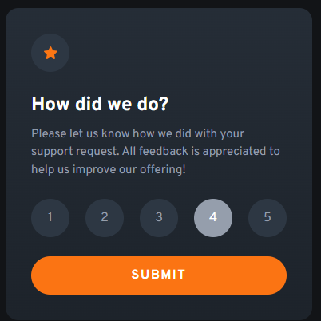
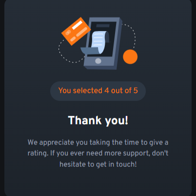

# Rating_Component
# Frontend Mentor - Interactive rating component solution

This is a solution to the [Interactive rating component challenge on Frontend Mentor](https://www.frontendmentor.io/challenges/interactive-rating-component-koxpeBUmI). Frontend Mentor challenges help you improve your coding skills by building realistic projects. 

## Table of contents

- [Overview](#overview)
  - [The challenge](#the-challenge)
  - [Screenshot](#screenshot)
  - [Links](#links)
- [Author](#author)

## Overview

### The challenge

Users should be able to:

- View the optimal layout for the app depending on their device's screen size
- See hover states for all interactive elements on the page
- Select and submit a number rating
- See the "Thank you" card state after submitting a rating

### Screenshot

![./demo 1.png]

### Links

- Solution URL: [https://www.frontendmentor.io/solutions/interactive-rating-component-2lrJzHm5g2](https://www.frontendmentor.io/solutions/interactive-rating-component-2lrJzHm5g2)
- Live Site URL: [https://mahiratingcomponent.netlify.app/](https://mahiratingcomponent.netlify.app/)

## My process

### Built with

- HTML
- CSS
- Vanilla Js

## Author

- Website - [Mahedere Tebebe](https://www.your-site.com)
- Frontend Mentor - [@Mahedere](https://www.frontendmentor.io/profile/Mahedere)

